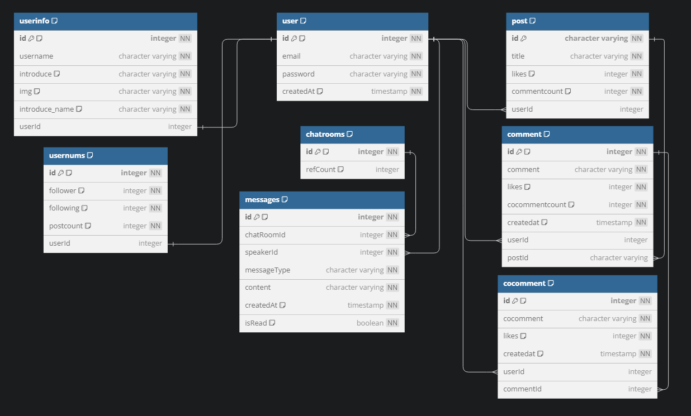
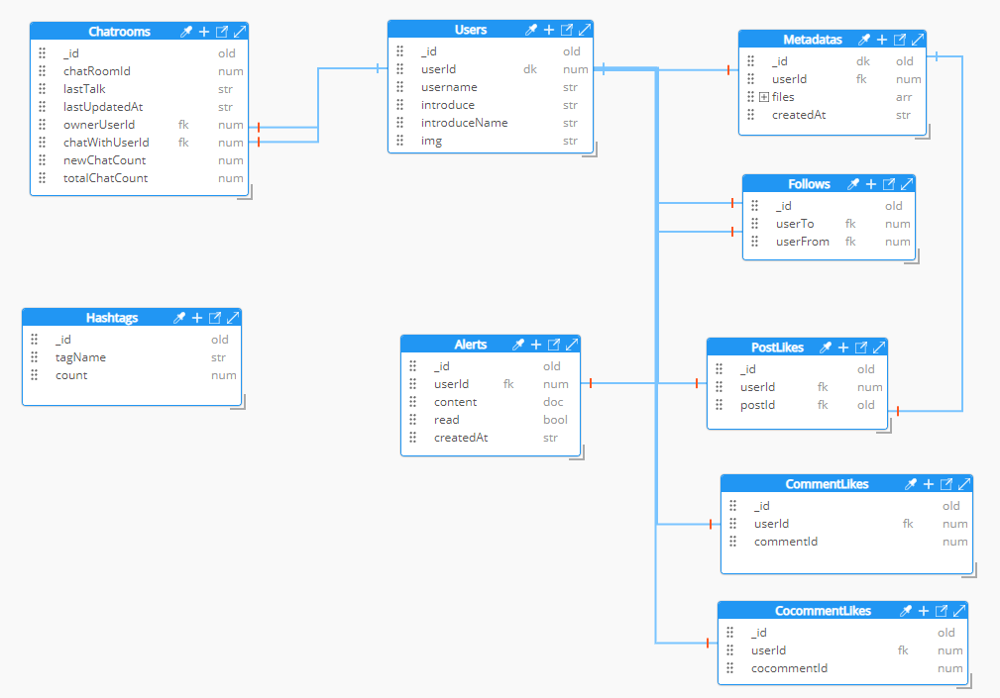

https://creamisbeast.xyz

# sns 프로젝트

배포 도메인

https://creamisbeast.xyz

인스타그램을 클론코딩 하는 느낌으로 sns을 만들어보자.

각 페이지별 DEMO

https://www.notion.so/96e1a3db3fd745d497ae8513257e4d29

## 기술스택

    FRONT - react

    BACK - nestjs fastify docker (grpc-node Rabbitmq)

    DB - postgres typeorm mongodb elasticsearch

    CLOUD - AWS EC2, RDS, Opensearch, AzureStorage

    nginx JWT socket.io

## 프로젝트 구조

## ERD

postgres ERD

mongo ERD

## 주요 Backend 코드 위치

#### /server

- /gateway → nestjs
- /upload → fastify

#### **/server/gateway/src** ⭐⭐⭐

- /module ⭐⭐⭐⭐⭐ 주요 코드 총집합
  - /alert
    - /repository → db연결을 위한 repository 존재
    - alert.module, controller, service
    - (아래 디렉터리들은 이와 비슷한 구조로 구성됨.)
  - /auth
  - /direct
  - /이외 모듈들..
- app.module, controller, service
- main.ts

#### 모듈 목록

1. alert → 알림
2. auth → 인증
3. direct → dm 담당, 실시간 통신
4. ffl → 팔로우와 좋아요
5. metadata → 사진 url 담당
6. post → 게시물과 관련된 데이터 담당
7. search → 검색 담당, 실시간 통신
8. upload → 업로드 결과를 담당
9. user → user 전반을 담당

## 프로젝트 실행

루트 디렉터리에서

1. docker-compose -f 'db.yml' up
2. docker-compose up
3. docker-compose -f 'nginx.yml' up

순서로 docker 띄우고 다 올라오면 localhost 3000번으로 진입.

docker-compose.yml에 프런트 react, 백 서버가 다 있어서 1, 3번은 -d로 올려도 됨.

## 테스트용 mock data 삽입

mock.controller.ts 에 있는 api를 이용하면 됨.

예시) GET localhost:4000/mock/insertMockUser
